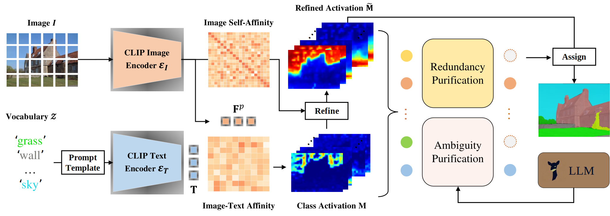

<div align="center">
 
 <h1> FreeCP: Training-Free Class Purification for Open-Vocabulary Semantic Segmentation </h1>

Qi Chen<sup>12</sup>, &nbsp; 
Lingxiao Yang<sup>1</sup>, &nbsp; 
Yun Chen<sup>3</sup>, &nbsp; 
Nailong Zhao<sup>4</sup>, &nbsp;
Jianhuang Lai<sup>1</sup>, &nbsp;
Jie Shao<sup>2</sup>, &nbsp;
Xiaohua Xie<sup>1</sup>, &nbsp;

<sup>1</sup>Sun Yat-sen University, &nbsp;
<sup>2</sup>ByteDance Intelligent Creation, &nbsp;
<sup>3</sup>University of Surrey, &nbsp;
<sup>4</sup>Alibaba Cloud Computing

<div>
    <h4 align="center">
        • <a href="https://openaccess.thecvf.com/content/ICCV2025/papers/Chen_Training-Free_Class_Purification_for_Open-Vocabulary_Semantic_Segmentation_ICCV_2025_paper.pdf" target='_blank'>[Paper]</a> •
    </h4>
</div>

</div>

## 🚀 Overview
<div align="center">
 
</div>

## 📦 Dependencies and Installation


```
# git clone this repository
git clone https://github.com/chenqi1126/FreeCP.git
cd FreeCP

# create new anaconda env
conda create -n freecp python=3.10
conda activate freecp

# install torch and dependencies
pip install -r requirements.txt
```


## 🗂️ Datasets
Please follow the [MMSeg data preparation document](https://github.com/open-mmlab/mmsegmentation/blob/main/docs/en/user_guides/2_dataset_prepare.md) and [ClearCLIP](https://github.com/mc-lan/ClearCLIP) to download and pre-process the datasets. 
```shell
dataset
├── ADE
│   ├── ADEChallengeData2016
│   │   ├── annotations
│   │   │   ├── training
│   │   │   ├── validation
│   │   ├── images
│   │   │   ├── training
│   │   │   ├── validation
├── Cityscapes
│   ├── leftImg8bit
│   │   ├── train
│   │   ├── val
│   ├── gtFine
│   │   ├── train
│   │   ├── val
├── ms_coco_17
│   ├── images
│   │   ├── train2017
│   │   ├── val2017
│   ├── annotations
│   │   ├── object
│   │   ├── stuff
├── PascalVOC
│   ├── VOC2012
│   │   ├── JPEGImages
│   │   ├── SegmentationClass
│   │   ├── ImageSets
│   │   │   ├── Segmentation
│   ├── VOC2010
│   │   ├── JPEGImages
│   │   ├── SegmentationClassContext
│   │   ├── ImageSets
│   │   │   ├── SegmentationContext
│   │   │   │   ├── train.txt
│   │   │   │   ├── val.txt
```

## 🚀 Model evaluation

Single-GPU:

```
python eval.py --config ./config/cfg_DATASET.py --workdir YOUR_WORK_DIR
```

Multi-GPU:
```
bash ./dist_test.sh ./config/cfg_DATASET.py
```
                 
## 📈 Results

| Method | VOC21 | PC60 | Object | VOC20 | Cityscapes | PC59 | ADE | Stuff | Average |
|--------|-------|------|--------|-------|------------|------|-----|-------|-----|
| MaskCLIP | 43.4 | 23.2 | 20.6 | 74.9 | 24.9 | 26.4 | 11.9 | 16.7 | 30.3 |
| + FreeCP | 64.4 | 34.7 | 36.2 | 84.1 | 32.5 | 36.6 | 17.6 | 23.3 | 41.2 |
| GEM | 56.9 | 32.6 | 31.1 | 79.9 | 30.8 | 35.9 | 15.7 | 23.7 | 38.3 |
| + FreeCP | 64.7 | 35.5 | 36.9 | 80.6 | **35.7** | 39.1 | 17.8 | 25.8 | 42.0 |
| SCLIP | 59.1 | 30.4 | 30.5 | 80.4 | 32.2 | 34.2 | 16.1 | 22.4 | 38.2 |
| + FreeCP | **65.8** | 35.3 | **37.2** | **84.3** | 33.3 | 38.0 | 18.4 | 24.9 | 42.1 |
| ClearCLIP | 51.8 | 32.6 | 33.0 | 80.9 | 30.0 | 35.9 | 16.7 | 23.9 | 38.1 |
| + FreeCP | 64.5 | **35.7** | 36.9 | 81.5 | 34.4 | **39.3** | **18.9** | **26.1** | **42.2** |

## 📚 Citation

```
@inproceedings{chen2025freecp,
  title={Training-Free Class Purification for Open-Vocabulary Semantic Segmentation},
  author={Qi Chen, Lingxiao Yang, Yun Chen, Nailong Zhao, Jianhuang Lai, Jie Shao, Xiaohua Xie},
  booktitle={Proceedings of the IEEE/CVF International Conference on Computer Vision},
  year={2025}
}
```

## 🙏 Acknowledgement
This implementation is based on [ClearCLIP](https://github.com/mc-lan/ClearCLIP), [SCLIP](https://github.com/wangf3014/SCLIP) and [CLIP-ES](https://github.com/linyq2117/CLIP-ES). Thanks for the awesome work.
